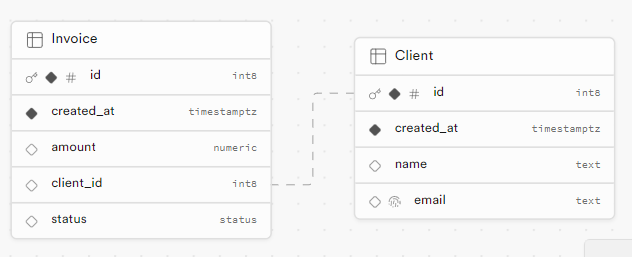

# Recap of the GCF Project

GCF stands for "Gestion de Clients et de Factures". This project aims to implement a frontend application for managing client and invoice data. It uses React, React Router, Webpack, and Supabase for building the application. 

The application allows users to:
- Add new clients and invoices
- View a list of clients 
- View details of a client and his invoices

The application also includes a test suite using Cypress for end-to-end testing.

Overall, this project demonstrates a basic implementation of a React application with routing and data management features.

Here is the schema of my database:

